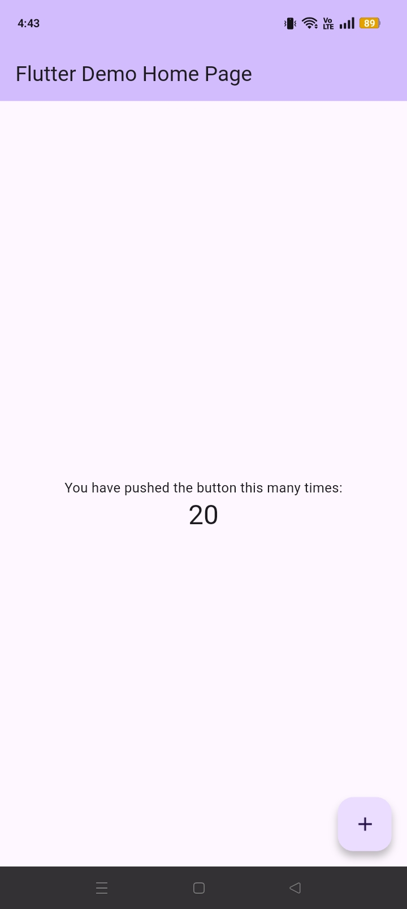

# Proyectos de Introducción a Flutter

Este repositorio contiene los entregables académicos para la actividad de familiarización con el entorno de desarrollo Flutter, el proceso de compilación de aplicaciones móviles y la gestión de versiones.

## Descripción de la Actividad
El objetivo principal es demostrar la capacidad de crear, configurar y compilar aplicaciones en Flutter, generando entregables instalables (APK) y documentando el proceso mediante control de versiones .

## Estructura del Repositorio

El proyecto se organiza como un monorepo que contiene dos aplicaciones independientes:

### 1. Proyecto Base (`/proyecto_base_app`)
* **Plantilla utilizada:** Application (Flutter Counter App).
* **Descripción:** Proyecto generado por defecto que demuestra el uso de `StatefulWidget` y la estructura básica de contadores en Flutter.
* **Estado:** Compilable.

### 2. Proyecto Vacío (`/proyecto_vacio_app`)
* **Plantilla utilizada:** Empty Application.
* **Descripción:** Proyecto configurado con una estructura minimalista. Se ha limpiado el código base para presentar un `Scaffold` limpio, cumpliendo con el requerimiento de iniciar un proyecto desde cero .
* **Estado:** Compilable.

---

## Instrucciones de Compilación

Para generar los archivos instalables (`.apk`) en modo *release* para cualquiera de los dos proyectos, siga estos pasos en su terminal:

1.  Navegar a la carpeta del proyecto deseado:
    ```bash
    cd proyecto_base_app
    # o
    cd proyecto_vacio_app
    ```

2.  Ejecutar el comando de compilación:
    ```bash
    flutter build apk --release
    ```

3.  **Ubicación del archivo:** El APK generado se encontrará automáticamente en:
    `build/app/outputs/flutter-apk/app-release.apk`

---

## 📱 Evidencias de Funcionamiento

Las capturas de pantalla a continuación demuestran la correcta instalación y ejecución de los archivos APK generados en un dispositivo móvil físico .

| Proyecto Base | Proyecto Vacío |
|:-------------:|:--------------:|
|  |  |

---

## Autor
**Sadid Enrique Acosta Osorio**

Ingeniero Multimedia.
